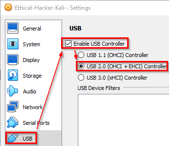

# Linux Setup

The utilities to work with infotainment systems work well in Linux. It is possible to use Linux installed on a computer directly or using a virtual machine. If using a virtual machine, several settings need to be updated.

## VirtualBox Setup

A Linux virtual machine in VirtualBox needs to support USB.

* Right-click on your virtual machine and view the settings.
* Open the USB menu. Ensure that the USB option is enabled.

* If the USB option is not enabled, you will need to:
  * Shut down your virtual machine. (You cannot simply save the machine state.)
  * Edit the properties.
  * Select the USB category.
  * Check the box to enable USB support.
  * Select USB 2.0.

Note that when you insert a USB device, you will need to attach the USB device to a running virtual machine using the *Device* menu.
