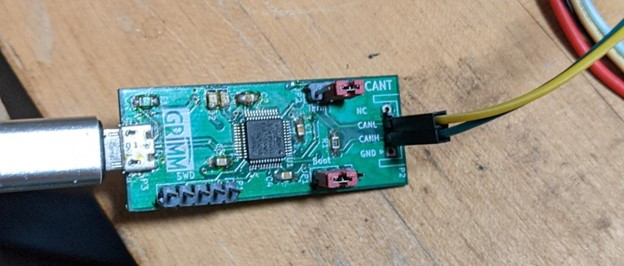

# Infotainment Lab 1

CAN Bus is a ubiquitous communication bus that is used to transmit information between the various Electronic Control Units (ECUs) in a vehicle. CAN bus is designed to be a cheap, reliable and inexpensive communication network, but was designed with no inherent security mechanisms. Verifying the source of a message on the CAN bus is difficult, and not generally done on a vehicle platform. This allows any attacker with physical access to the CAN bus to impersonate any device, causing other devices to respond as if the messages being transmitted by the attacker are legitimate. We will explore this capability by causing our infotainment unit to display a message.

## Setup

This lab uses a CAN device called a CANable, coupled with Linux’s Socketcan tools. Socketcan allows CAN devices to be used like any other network device on a Linux system. You will need the can-utils software package installed on your Linux system.

If you already have the **can-utils** package installed, skip the following step. Running these commands again if you already have the package installed will not harm anything.

```shell
sudo apt update
sudo apt install can-utils
```

## Wiring

Connect the CANable device to the infotainment system wiring harness as pictured, with the yellow wire connected to CANL and the green wire connected to CANH. Connect the micro USB cable from the CANable to your computer.



Turn the infotainment system on by connecting the power supply to the barrel connector on the wiring harness and turning the switch on.


Set up the CAN network on the Linux machine by running these commands in a terminal window.

```shell
sudo ip link set can0 type can bitrate 500000
sudo ip link set up can0
```

## Reading CAN Data

Linux can-utils has several utilities for reading messages from and sending messages on the CAN bus. Start by looking at the CAN traffic being sent by the infotainment system by running the following command:

```shell
candump can0
```

You should see CAN messages being printed to the screen. Press CTRL-C to quit the candump program.

## Sending CAN Data

Now, send a specific message on the CAN bus by running the following command:

```shell
cansend can0 445#872c4763
```

Watch the infotainment screen. This CAN message encodes the backup warning message including proximity to objects. The CAN message is identified by an arbitration ID, which for this message is the value 0x445. The data of this message is the hex string 872c4763. Try changing this data to see how the proximity warning display changes (for example, try sending the data section as 872c4993 to see if the display changes). The arbitration ID needs to be left as 445.

## Conclusion

Since CAN provides no protection against replay attacks, nothing prevents an attacker with physical access from sending arbitrary CAN messages to cause ECUs to misbehave. This misbehavior could include displaying spurious warning messages, and even control of steering, braking and acceleration in some vehicles.
