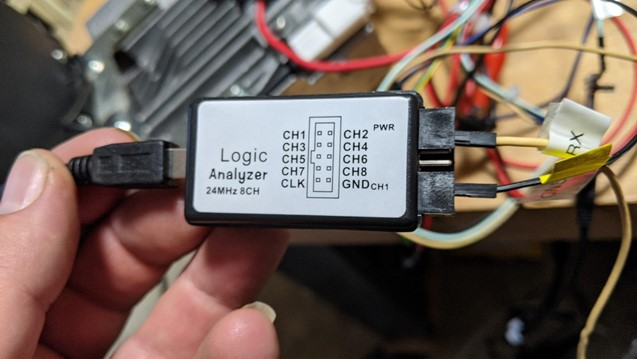
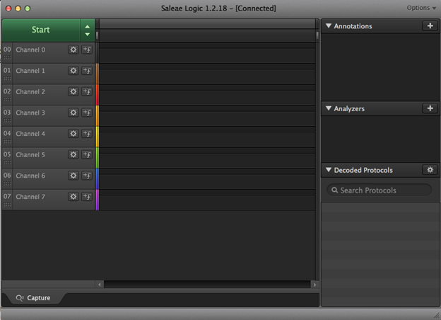
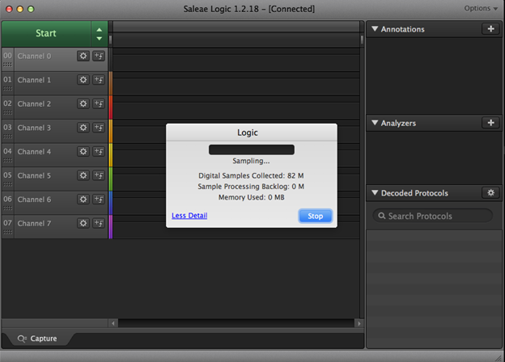
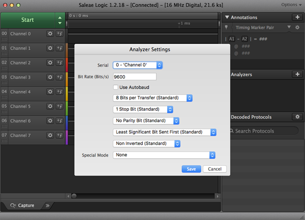

# Infotainment Lab 2 (Medium)

During product development, developers need debugging access to the system. This debugging access often happens over a serial console. Frequently, this serial debugging access isn’t disabled, or isn’t fully disabled once the system goes into production. Using a logic analyzer to find these unused serial ports is often a productive early step when hacking hardware.

This lab should be done in Windows.

## Software Installation

Download and install the Saleae LOGIC software from <https://www.saleae.com/downloads/>.

## Wiring

Connect the line labeled RX to pin 1 of the logic analyzer and connect the line labeled GND to the GND pin. Use the mini USB cable to attach the logic analyzer to the computer as pictured. Plug the power supply into the infotainment system, but do not turn the infotainment system on.

## Collect Data

* Turn the infotainment unit off if it is on.
* Start collecting data from the Logic Analyzer by pressing the "Start" button at the top left corner. You can change sampling parameters by pressing the down arrow on the right side of the start button. Since serial consoles are slow, try sampling for 30 seconds at a rate of 1 Mbps.

* Turn the power on to the CMU. Wait for data collection to finish:

* If you zoom out, you should see pulses on Channel 0 (Pin 1 on the logic analyzer corresponds to Channel 0 in the software). Press the + arrow in the Analyzers section on the right and add the following "Async Serial" analyzer with a bit rate of 115200. You can also experiment with using the Autobaud setting to try to automatically guess the bit rate:

* In the bottom right corner of the screen you should see the decoded serial signal. It should look like boot messages from a Linux system.

## Conclusion

Logic analyzers are useful tools for investigating unknown signals and determining what they are. We can use the knowledge gained in this lab about how to access the serial console to allow us to complete the next lab.
