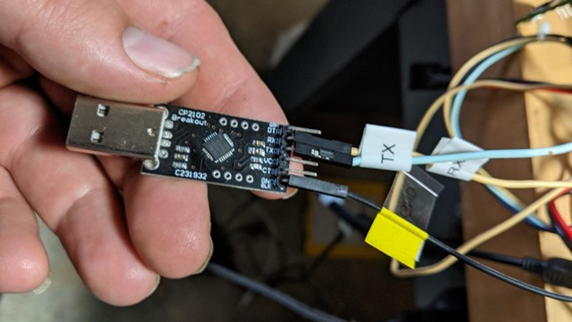

# Infotainment Lab 3 (Hard)

Now that we have found the debug serial console, let’s explore it and see what access it gives us.
Setup

* Connect the USB-Serial adapter to the infotainment system as pictured (RX to RX, TX to TX and GND to GND). The connection will look similar to the following, but be sure to use the labels on your specific adapter.



* Plug the USB-Serial adapter into the computer. Turn the infotainment system on.

* Type the following command on the linux console to connect to the serial console:

```shell
sudo screen /dev/ttyUSB0 115200
```

* We will see a lot of debugging messages being printed to the screen. For the first minute or two that the system is powered on there are a lot of messages being printed. After the first couple of minutes the messages slow, but do not stop. It’s important to note that these debugging messages do not affect any commands we are about to run on the infotainment system, so continue typing the following commands even if debug messages obscure or seem to overwrite what you are typing.
* Press enter to get to the login screen. Log in with the following credentials (Note: the username is root if your infotainment system has a label on it that says “Username: root”):
  * Username: cmu
  * Password: jci
* Sometimes debugging scripts are left on systems. If we look in the directory /jci we will see a great number of these scripts on this system. One that stands out on further investigation is the **jci-wifiap.sh** script which appears to set up a wireless access point. This infotainment unit isn’t supposed to have Wi-Fi, but the Bluetooth chip used is a combination Wi-Fi/Bluetooth chip and it appears the developers used the Wi-Fi access point functionality for debugging access. Let’s start the access point and see if we can connect to it. Run the following command on the infotainment system:

```shell
/jci/bin/jci-wifiap.sh start
```

* Connect to the new access point set up by the infotainment system. The name of this access point is CMU-MACADDR, where MACADDR is the MAC address of the WiFi chip on the unit. The MAC address is printed on a label on the bottom of the infotainment unit.
* Once connected, try to SSH into the infotainment system by running the following command (again, if your infotainment unit has a label that says Username: root substitute root for cmu in the following command):

```shell
ssh cmu@192.168.53.1
```

* Enter **jci** for the password.

At this point, you can run regular Linux commands and explore the contents of the infotainment computer.

The SSH console is easier to use than the serial console since you don’t have debugging messages being printed to the screen, though the responsiveness of the SSH console is not very good and will often seem to hang.

## Conclusion

Finding debugging scripts and programs on embedded systems can be a powerful way to understand and get access to a system.


